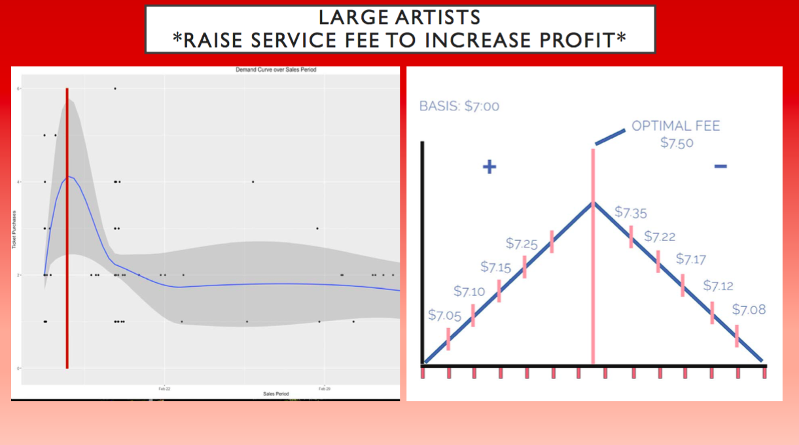
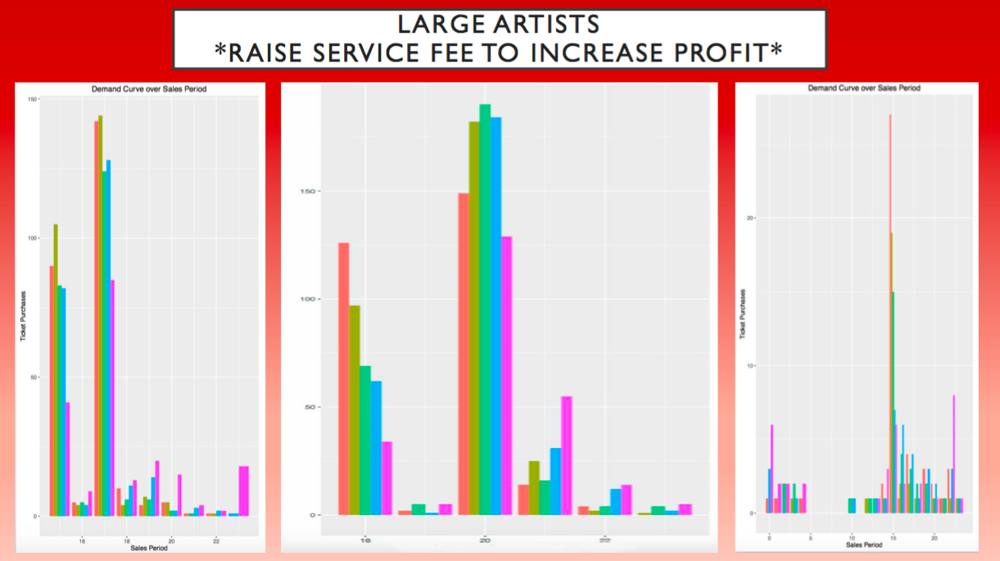

# DataFest at UCLA 2016

Final presentation from DataFest 2016 by The Improbables: Sydney Kahnmann, Donjo Lau, Juan Mendoza, James Wilson, Aida Ylanan

Data provided by *Ticketmaster Inc.* to be used within the competition only. Therefore, only the results will be shared:

## Analysis

---

Our team examined ticket sales over time to develop a sales strategy for *Ticketmaster*. We discovered that popular artists bring a spike in ticket demand, which Ticketmaster could capitalize upon by increasing sale fees at particular times. 

The plot on the left displays how changes in demand change over time, from the moment the tickets go on sale to days after the initial listing. The plot on the right is a simplified chart exploring how ticket fees can change depending on ticket demand: 

---

The three plots below are three different analyses of ticket demand over time, from three different popular artists:

